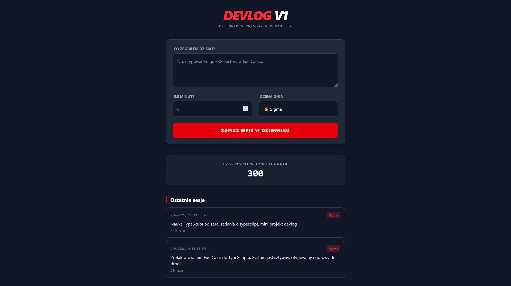
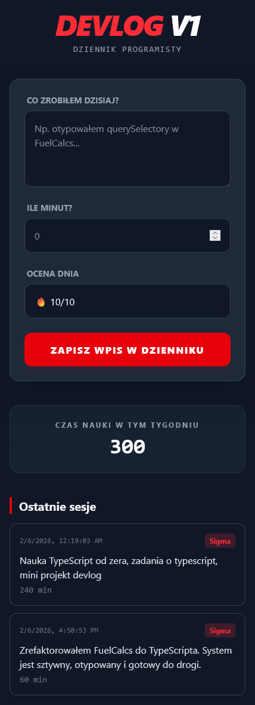

# DevLog 👋

<div style="display: flex;">
  
  
</div>

## About 👀


DevLog. <br/>

Mobile version: yes!

## How can I try it? 🤔

Try now on: https://developerlog.netlify.app/ <br/>

## Instalation steps 📋

1. Copy this repository

```
gh repo clone BartoszBuko/DevLog
cd ./DevLog
```

or

```
git clone https://github.com/BartoszBuko/DevLog.git
cd ./DevLog
```

2. Open files in browser.

And that's all!

## About UX/UI 🖌️

I made design all by myself




<br>

## Technological facilities 🛠️

- HTML5
- CSS3
- TypeScript 5.9.3
- TailWindCSS
